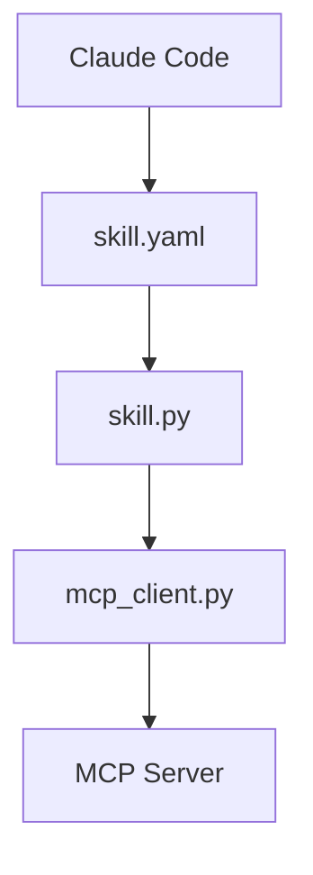
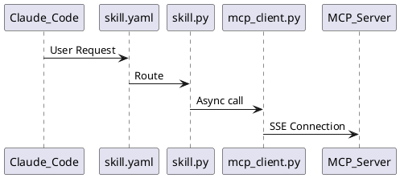

# Architecture Diagram Creation Guide

## Overview

This guide explains how to create a professional PDF architecture diagram for the catalog_lookup_http skill using Python and Graphviz. The resulting diagram visually represents the complete system architecture, data flow, and component relationships.

## Table of Contents

1. [Prerequisites](#prerequisites)
2. [Installation](#installation)
3. [Creating the Diagram Script](#creating-the-diagram-script)
4. [Understanding the Code](#understanding-the-code)
5. [Running the Script](#running-the-script)
6. [Customization Options](#customization-options)
7. [Troubleshooting](#troubleshooting)
8. [Alternative Approaches](#alternative-approaches)

---

## Prerequisites

### Required Software

- **Python 3.7+**: Programming language runtime
- **Graphviz**: Graph visualization software
- **graphviz Python package**: Python bindings for Graphviz

### Skills Needed

- Basic Python programming
- Understanding of architecture diagrams
- Command-line interface usage

---

## Installation

### Step 1: Install Graphviz Software

#### macOS (using Homebrew)
```bash
brew install graphviz
```

#### Ubuntu/Debian
```bash
sudo apt-get update
sudo apt-get install graphviz
```

#### Windows
Download and install from: https://graphviz.org/download/

### Step 2: Install Python Package

```bash
pip install graphviz
```

Or if using pip3:
```bash
pip3 install graphviz
```

### Step 3: Verify Installation

```bash
# Check Graphviz software
dot -V

# Check Python package
python3 -c "import graphviz; print(graphviz.__version__)"
```

Expected output:
```
dot - graphviz version X.X.X
0.20.1  # or similar version number
```

---

## Creating the Diagram Script

### File Structure

Create the following file in your skill directory:

```
/Users/ghu/.claude/skills/
├── catalog_lookup_http/
│   ├── skill.py
│   ├── skill.yaml
│   ├── mcp_server.py
│   └── mcp_client.py
└── render_architecture_diagram.py  ← Create this file
```

### Complete Script

Create `render_architecture_diagram.py` with the following content:

```python
#!/usr/bin/env python3
"""
Render catalog_lookup_http skill architecture diagram to PDF
"""

from graphviz import Digraph

def create_architecture_diagram():
    """Create a comprehensive architecture diagram for catalog_lookup_http skill"""

    # Create a new directed graph
    dot = Digraph(comment='catalog_lookup_http Architecture', format='pdf')
    dot.attr(rankdir='TB', size='11,17', dpi='300')
    dot.attr('node', shape='box', style='rounded,filled', fontname='Arial')
    dot.attr('edge', fontname='Arial', fontsize='10')

    # Main title
    dot.attr(label='Catalog Lookup HTTP/SSE MCP Skill Architecture\\nVersion 4.0.0',
             fontsize='20', fontname='Arial Bold', labelloc='t')

    # 1. Claude Code (Client)
    dot.node('claude', 'Claude Code\\n(Client)',
             fillcolor='lightblue', fontsize='14', shape='box', style='filled,rounded')

    # 2. Skill Layer
    with dot.subgraph(name='cluster_skill') as c:
        c.attr(label='Skill Layer', style='dashed', color='blue')
        c.node('yaml', 'skill.yaml\\nv4.0.0\\n\\n4 Operations:\\n• get_catalog_item\\n• get_summary_item\\n• search_catalog\\n• list_tools',
               fillcolor='lightyellow', fontsize='11')
        c.node('perms', 'Permissions\\nGranted in settings',
               fillcolor='lightgreen', fontsize='10')

    # 3. skill.py (Entrypoint)
    dot.node('skill_py', 'skill.py\\n(Python Handler)\\n\\n• Operation routing\\n• Parameter validation\\n• JSON serialization\\n• Async execution',
             fillcolor='wheat', fontsize='11')

    # 4. mcp_client.py
    dot.node('mcp_client', 'mcp_client.py\\n(MCP Client)\\n\\n• SSE connection\\n• Session management\\n• Tool invocation',
             fillcolor='lightcoral', fontsize='11')

    # 5. MCP Server
    dot.node('mcp_server', 'MCP Server\\n(mcp_server.py)\\n\\nHTTP/SSE Transport\\nlocalhost:3333',
             fillcolor='plum', fontsize='12', shape='box3d')

    # 6. MCP Tools
    with dot.subgraph(name='cluster_tools') as c:
        c.attr(label='MCP Tools', style='filled', color='lightgray', fillcolor='white')
        c.node('tool1', 'get_catalog_item\\n\\nInput: item_id\\nOutput: Basic catalog data\\n(id, name, price, currency, status)',
               fillcolor='lightcyan', fontsize='10')
        c.node('tool2', 'get_summary_item\\n\\nInput: item_id\\nOutput: Summary data\\n(summary, sale_price, country)',
               fillcolor='lightcyan', fontsize='10')
        c.node('tool3', 'search_catalog\\n\\nInput: query\\nOutput: Array of items\\nmatching search',
               fillcolor='lightcyan', fontsize='10')

    # Operations Panel (to the right)
    with dot.subgraph(name='cluster_ops') as c:
        c.attr(label='Operation Flows', style='filled', color='darkgreen', fillcolor='honeydew')
        c.node('op1', '1. get_catalog_item\\nitem_id → Basic catalog data',
               fillcolor='white', fontsize='9', shape='note')
        c.node('op2', '2. get_summary_item\\nitem_id → Summary with pricing',
               fillcolor='white', fontsize='9', shape='note')
        c.node('op3', '3. search_catalog\\nquery → Array of results',
               fillcolor='white', fontsize='9', shape='note')
        c.node('op4', '4. list_tools\\nno params → Tool schemas',
               fillcolor='white', fontsize='9', shape='note')

    # Key Features Panel
    with dot.subgraph(name='cluster_features') as c:
        c.attr(label='Key Features', style='filled', color='darkred', fillcolor='mistyrose')
        c.node('features',
               'Version 4.0.0\\nHTTP/SSE Transport\\nJSON Serialization Fix\\nPermission Granted\\nBackward Compatible\\nTool Discovery',
               fillcolor='white', fontsize='9', shape='note')

    # Main flow edges
    dot.edge('claude', 'yaml', label='User Request', color='blue', penwidth='2')
    dot.edge('yaml', 'skill_py', label='Route to handler', color='blue')
    dot.edge('perms', 'skill_py', style='dashed', color='green')
    dot.edge('skill_py', 'mcp_client', label='Async call', color='blue')
    dot.edge('mcp_client', 'mcp_server', label='SSE Connection\\nlocalhost:3333/sse', color='blue', penwidth='2')

    # Server to tools
    dot.edge('mcp_server', 'tool1', label='invoke', color='purple')
    dot.edge('mcp_server', 'tool2', label='invoke', color='purple')
    dot.edge('mcp_server', 'tool3', label='invoke', color='purple')

    # Return flow
    dot.edge('mcp_server', 'mcp_client', label='JSON Response', color='red', style='dashed')
    dot.edge('mcp_client', 'skill_py', label='CallToolResult', color='red', style='dashed')
    dot.edge('skill_py', 'yaml', label='Parse & Format', color='red', style='dashed')
    dot.edge('yaml', 'claude', label='Return to Client', color='red', style='dashed', penwidth='2')

    # Special list_tools flow
    dot.edge('mcp_client', 'mcp_server', label='session.list_tools()',
             color='orange', style='dotted', constraint='false')

    # Operation references (invisible edges for layout)
    dot.edge('yaml', 'op1', style='invis')
    dot.edge('yaml', 'op2', style='invis')
    dot.edge('yaml', 'op3', style='invis')
    dot.edge('yaml', 'op4', style='invis')
    dot.edge('yaml', 'features', style='invis')

    return dot

if __name__ == '__main__':
    print("Generating catalog_lookup_http architecture diagram...")

    diagram = create_architecture_diagram()

    # Save to PDF
    output_path = '/Users/ghu/.claude/skills/catalog_lookup_http_architecture'
    diagram.render(output_path, cleanup=True)

    print(f"✅ Diagram saved to: {output_path}.pdf")
    print(f"📍 File size: ", end='')

    import os
    size = os.path.getsize(f"{output_path}.pdf")
    print(f"{size / 1024:.1f} KB")
```

---

## Understanding the Code

### Key Components

#### 1. Graph Configuration

```python
dot = Digraph(comment='catalog_lookup_http Architecture', format='pdf')
dot.attr(rankdir='TB', size='11,17', dpi='300')
```

- **rankdir='TB'**: Top-to-bottom layout (use 'LR' for left-to-right)
- **size='11,17'**: Canvas size in inches
- **dpi='300'**: High resolution for print quality
- **format='pdf'**: Output format

#### 2. Node Styles

```python
dot.attr('node', shape='box', style='rounded,filled', fontname='Arial')
```

Common node shapes:
- `box`: Rectangle
- `ellipse`: Oval
- `diamond`: Diamond shape
- `box3d`: 3D box effect
- `note`: Document/note shape

Common styles:
- `filled`: Fill with color
- `rounded`: Rounded corners
- `dashed`: Dashed border
- `bold`: Bold border

#### 3. Subgraphs (Clusters)

```python
with dot.subgraph(name='cluster_skill') as c:
    c.attr(label='Skill Layer', style='dashed', color='blue')
    c.node('yaml', '...')
```

Subgraphs group related nodes with a border and label. Name must start with 'cluster_' for visible grouping.

#### 4. Edges (Connections)

```python
dot.edge('claude', 'yaml', label='User Request', color='blue', penwidth='2')
```

Edge attributes:
- **label**: Text on the arrow
- **color**: Arrow color
- **style**: Line style (solid, dashed, dotted)
- **penwidth**: Line thickness
- **constraint**: Layout constraint (false allows flexible positioning)

#### 5. Color Palette

Used colors and their meanings:
- **lightblue**: Entry point (Claude Code)
- **lightyellow**: Configuration (skill.yaml)
- **lightgreen**: Security (permissions)
- **wheat**: Logic layer (skill.py)
- **lightcoral**: Communication (mcp_client)
- **plum**: Server component
- **lightcyan**: Tools/operations
- **blue**: Request flow
- **red**: Response flow
- **purple**: Internal invocations

---

## Running the Script

### Execute the Script

```bash
# Navigate to the directory
cd /Users/ghu/.claude/skills

# Make it executable (optional)
chmod +x render_architecture_diagram.py

# Run the script
python3 render_architecture_diagram.py
```

### Expected Output

```
Generating catalog_lookup_http architecture diagram...
✅ Diagram saved to: /Users/ghu/.claude/skills/catalog_lookup_http_architecture.pdf
📍 File size: 109.4 KB
```

### Verify the PDF

```bash
# Check file exists
ls -lh catalog_lookup_http_architecture.pdf

# Open the PDF
open catalog_lookup_http_architecture.pdf  # macOS
xdg-open catalog_lookup_http_architecture.pdf  # Linux
start catalog_lookup_http_architecture.pdf  # Windows
```

---

## Customization Options

### Change Output Format

```python
# PNG format
dot = Digraph(format='png')

# SVG format (scalable vector graphics)
dot = Digraph(format='svg')

# Multiple formats
diagram.render(output_path, format='pdf')
diagram.render(output_path, format='png')
```

### Adjust Layout Direction

```python
# Left to right
dot.attr(rankdir='LR')

# Bottom to top
dot.attr(rankdir='BT')

# Right to left
dot.attr(rankdir='RL')
```

### Change Color Scheme

```python
# Professional blue theme
fillcolor='#E3F2FD'  # Light blue
color='#1976D2'       # Dark blue

# Modern green theme
fillcolor='#E8F5E9'  # Light green
color='#388E3C'       # Dark green

# Corporate grey theme
fillcolor='#EEEEEE'  # Light grey
color='#424242'       # Dark grey
```

### Modify Font Settings

```python
# Change font family
dot.attr('node', fontname='Helvetica')
dot.attr('edge', fontname='Courier')

# Change font size
dot.attr('node', fontsize='12')
dot.attr('edge', fontsize='10')

# Bold font
dot.attr('node', fontname='Arial Bold')
```

### Add More Details

```python
# Add timestamp
from datetime import datetime
timestamp = datetime.now().strftime('%Y-%m-%d %H:%M:%S')
dot.attr(label=f'Architecture Diagram\\nGenerated: {timestamp}')

# Add version info
dot.node('version_info', f'Skill Version: {VERSION}\\nDiagram Version: {DIAGRAM_VERSION}',
         shape='plaintext', fontsize='8')
```

---

## Troubleshooting

### Issue 1: "graphviz module not found"

**Solution:**
```bash
pip3 install graphviz
```

### Issue 2: "dot command not found" or "Graphviz's executables not found"

**Cause:** Graphviz software not installed

**Solution:**
```bash
# macOS
brew install graphviz

# Ubuntu/Debian
sudo apt-get install graphviz

# Verify
which dot
```

### Issue 3: "Permission denied"

**Solution:**
```bash
# Make script executable
chmod +x render_architecture_diagram.py

# Or change output path to a writable directory
output_path = os.path.expanduser('~/Desktop/diagram')
```

### Issue 4: PDF is too large or too small

**Solution:** Adjust size and DPI
```python
# Larger diagram
dot.attr(size='17,22', dpi='300')

# Smaller diagram
dot.attr(size='8,10', dpi='150')

# Let Graphviz auto-size
dot.attr(size='')
```

### Issue 5: Text overlapping or cut off

**Solution:** Adjust spacing
```python
# More spacing between ranks
dot.attr(ranksep='1.0')

# More spacing between nodes
dot.attr(nodesep='0.75')

# Wider margins
dot.attr(margin='0.5')
```

### Issue 6: Layout looks wrong

**Solution:** Try different layout engines
```python
# Default is 'dot' - good for hierarchical
dot = Digraph(engine='dot')

# Try 'neato' for force-directed layout
dot = Digraph(engine='neato')

# Try 'fdp' for undirected graphs
dot = Digraph(engine='fdp')

# Try 'circo' for circular layout
dot = Digraph(engine='circo')
```

---

## Alternative Approaches

### 1. Using Mermaid (Markdown-based)

**Pros:** Simple syntax, can embed in markdown, GitHub renders it
**Cons:** Limited customization, requires online renderer or plugin



### 2. Using PlantUML

**Pros:** Rich diagram types, text-based
**Cons:** Requires Java, different syntax



### 3. Using draw.io (Manual)

**Pros:** Visual editor, many shapes
**Cons:** Manual work, not scriptable

**Tool:** https://app.diagrams.net/

### 4. Using Python matplotlib/networkx

**Pros:** Full Python control, can integrate with data
**Cons:** More code, less optimized for diagrams

```python
import matplotlib.pyplot as plt
import networkx as nx

G = nx.DiGraph()
G.add_edge("Claude Code", "skill.yaml")
G.add_edge("skill.yaml", "skill.py")
# ... more edges

nx.draw(G, with_labels=True)
plt.savefig("diagram.pdf")
```

---

## Best Practices

### 1. Design Principles

- **Top-to-bottom flow**: Request flows down, responses flow up
- **Consistent colors**: Use color to categorize components
- **Clear labels**: Make edge labels descriptive
- **Grouping**: Use subgraphs for related components
- **White space**: Don't overcrowd the diagram

### 2. Code Organization

```python
def create_nodes(dot):
    """Create all nodes"""
    # Node creation logic

def create_edges(dot):
    """Create all edges"""
    # Edge creation logic

def create_clusters(dot):
    """Create subgraphs"""
    # Cluster creation logic

# Main function
def create_architecture_diagram():
    dot = Digraph(...)
    create_nodes(dot)
    create_clusters(dot)
    create_edges(dot)
    return dot
```

### 3. Version Control

Keep diagram code in version control alongside your skill:

```bash
git add render_architecture_diagram.py
git commit -m "Add architecture diagram generator"
```

### 4. Documentation

- Comment complex layout decisions
- Document color scheme choices
- Explain non-obvious edge relationships
- Include generation date in diagram

---

## Advanced Techniques

### HTML-like Labels

```python
dot.node('complex', '''<
<TABLE BORDER="0" CELLBORDER="1" CELLSPACING="0">
  <TR><TD BGCOLOR="lightblue"><B>skill.py</B></TD></TR>
  <TR><TD>Operation routing</TD></TR>
  <TR><TD>Parameter validation</TD></TR>
</TABLE>>''')
```

### Conditional Styling

```python
def add_node(dot, name, label, is_critical=False):
    color = 'red' if is_critical else 'blue'
    dot.node(name, label, fillcolor=color)
```

### Dynamic Content

```python
import yaml

# Read skill.yaml
with open('catalog_lookup_http/skill.yaml') as f:
    config = yaml.safe_load(f)

# Use actual version
version = config['version']
operations = list(config['inputs'].keys())
```

---

## Resources

### Documentation

- **Graphviz Official Docs**: https://graphviz.org/documentation/
- **Python graphviz Package**: https://graphviz.readthedocs.io/
- **Graphviz Gallery**: https://graphviz.org/gallery/
- **Node Shapes Reference**: https://graphviz.org/doc/info/shapes.html
- **Color Names**: https://graphviz.org/doc/info/colors.html

### Tools

- **Online Graphviz Editor**: https://dreampuf.github.io/GraphvizOnline/
- **Graphviz Visual Editor**: http://www.webgraphviz.com/

### Examples

- **Software Architecture Diagrams**: https://github.com/topics/architecture-diagram
- **Graphviz Examples**: https://renenyffenegger.ch/notes/tools/Graphviz/examples/index

---

## Conclusion

This guide provides a comprehensive approach to creating professional architecture diagrams using Python and Graphviz. The method is:

- **Scriptable**: Easy to regenerate when architecture changes
- **Version-controlled**: Diagram code lives with your project
- **Customizable**: Full control over appearance and layout
- **Professional**: High-quality output suitable for documentation

For the catalog_lookup_http skill, this approach successfully visualized:
- Component hierarchy
- Data flow (request and response)
- Four distinct operations
- Tool relationships
- Key features and metadata

The resulting PDF can be used in documentation, presentations, or shared with team members to quickly understand the system architecture.

---

## Quick Reference

### Common Commands

```bash
# Generate diagram
python3 render_architecture_diagram.py

# View source (Graphviz DOT language)
diagram.source

# Save without rendering
diagram.save('diagram.dot')

# Render to multiple formats
diagram.render(format='pdf')
diagram.render(format='png')
diagram.render(format='svg')
```

### Common Attributes

```python
# Graph
dot.attr(rankdir='TB', dpi='300', bgcolor='white')

# Nodes
dot.node('id', 'label', shape='box', fillcolor='lightblue')

# Edges
dot.edge('src', 'dst', label='text', color='blue', style='dashed')

# Subgraphs
with dot.subgraph(name='cluster_name') as c:
    c.attr(label='Group Name')
```

---

**Generated:** 2026-01-27
**Skill Version:** 4.0.0
**Diagram Tool:** Graphviz + Python
**Author:** Claude Code
