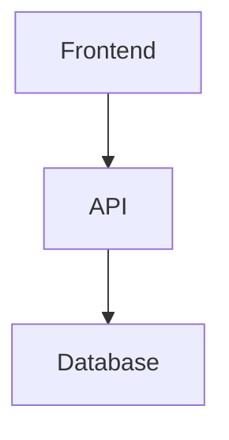
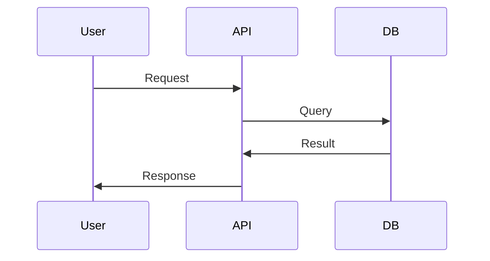

# easy-markdown-to-pdf

Convert markdown files to professionally formatted PDF documents without sudo requirements.

## Overview

This skill provides a **sudo-free alternative** to Pandoc-based PDF conversion. It uses:
- **Mermaid CLI (mmdc)** - Renders mermaid diagrams to PNG
- **Chrome headless** - Converts HTML to PDF

No LaTeX, no BasicTeX, no sudo access required!

## Prerequisites

**Automatic Installation:** Dependencies are automatically installed when needed:
- **Node.js** - JavaScript runtime (via Homebrew)
- **mermaid-cli (@mermaid-js/mermaid-cli)** - Diagram rendering (via npm)
- **Google Chrome** - Headless PDF generation (usually pre-installed on macOS)

## Features

✅ **No sudo required** - Works in restricted environments
✅ **Automatic mermaid rendering** - Detects and renders diagrams
✅ **Professional styling** - Clean, modern PDF layout
✅ **Table of contents** - Auto-generated from headings
✅ **Syntax highlighting** - Code blocks with color
✅ **Unicode support** - International characters and symbols
✅ **Custom themes** - Multiple style presets

## Usage

### Basic Conversion

```bash
# Simple conversion
./convert.sh input.md output.pdf

# With table of contents
./convert.sh input.md output.pdf --toc

# With custom theme
./convert.sh input.md output.pdf --theme=dark

# Landscape orientation
./convert.sh input.md output.pdf --landscape
```

### Options

- `--toc` - Generate table of contents
- `--theme=THEME` - Style theme: `light` (default), `dark`, `minimal`, `professional`
- `--landscape` - Use landscape orientation
- `--no-mermaid` - Skip mermaid diagram rendering
- `--keep-temp` - Keep temporary files for debugging

## How It Works

### Process Flow

```
1. Parse markdown file
2. Extract mermaid code blocks
3. Render mermaid diagrams to PNG (mmdc)
4. Replace mermaid blocks with image references
5. Convert markdown to HTML
6. Apply professional CSS styling
7. Generate PDF with Chrome headless
8. Clean up temporary files
```

### Mermaid Diagram Handling

**Automatic Detection:**
```markdown

```

**Rendered Output:**
- Diagram is rendered to PNG at high resolution (3200px width)
- Transparent background for clean integration
- Embedded in final PDF with proper sizing

### Styling

Four built-in themes:

**Light (default):**
- Clean white background
- Blue headers
- Professional font stack

**Dark:**
- Dark background (#1e1e1e)
- Light text (#e0e0e0)
- Reduced eye strain

**Minimal:**
- Minimalist design
- Gray tones
- Maximum content density

**Professional:**
- Corporate styling
- Serif fonts
- Traditional layout

## Examples

### Technical Documentation

```bash
./convert.sh architecture.md architecture.pdf \
  --toc \
  --theme=professional
```

### API Documentation

```bash
./convert.sh api-docs.md api-docs.pdf \
  --toc \
  --theme=light
```

### Architecture Diagram

```bash
./convert.sh system-design.md system-design.pdf \
  --toc \
  --landscape \
  --theme=minimal
```

### Dark Mode Documentation

```bash
./convert.sh README.md README.pdf \
  --toc \
  --theme=dark
```

## Comparison with Pandoc/LaTeX

| Feature | easy-markdown-to-pdf | Pandoc + LaTeX |
|---------|---------------------|----------------|
| Sudo required | ❌ No | ✅ Yes |
| Setup complexity | Low | High |
| Mermaid support | ✅ Auto | Manual |
| Unicode/Emoji | ✅ Full | ⚠️ Limited |
| Styling | CSS-based | LaTeX templates |
| File size | Moderate | Small |
| Quality | High | Very High |

## Advanced Usage

### Custom CSS Styling

Create a custom CSS file:

```css
/* custom.css */
body {
  font-family: "Georgia", serif;
  line-height: 1.8;
}

h1 {
  color: #2c3e50;
  border-bottom: 3px solid #e74c3c;
}

code {
  background: #ecf0f1;
  color: #e74c3c;
}
```

Then convert with custom CSS:

```bash
./convert.sh input.md output.pdf --css=custom.css
```

### Multiple Mermaid Diagrams

The script automatically handles multiple diagrams:

```markdown
# System Architecture



# Data Flow


```

All diagrams are rendered and embedded automatically.

### Batch Conversion

Convert multiple files:

```bash
#!/bin/bash
for md in docs/*.md; do
  pdf="${md%.md}.pdf"
  ./convert.sh "$md" "$pdf" --toc --theme=professional
done
```

## Configuration

### Environment Variables

```bash
# Chrome executable path (auto-detected)
export CHROME_PATH="/Applications/Google Chrome.app/Contents/MacOS/Google Chrome"

# Mermaid CLI path (auto-detected)
export MMDC_PATH="$(npm root -g)/@mermaid-js/mermaid-cli/src/cli.js"

# Temporary directory
export TEMP_DIR="/tmp/easy-md-to-pdf"
```

### Mermaid Configuration

Create `.mermaidrc.json` in your project:

```json
{
  "theme": "default",
  "themeVariables": {
    "primaryColor": "#3b82f6",
    "primaryTextColor": "#fff",
    "primaryBorderColor": "#1e40af",
    "lineColor": "#6b7280",
    "secondaryColor": "#10b981",
    "tertiaryColor": "#f59e0b"
  }
}
```

## Troubleshooting

### Chrome not found

**Error:** `Chrome executable not found`

**Solution:**
```bash
# macOS
export CHROME_PATH="/Applications/Google Chrome.app/Contents/MacOS/Google Chrome"

# Linux
export CHROME_PATH="/usr/bin/google-chrome"

# Or install Chrome
brew install --cask google-chrome
```

### Mermaid CLI not found

**Error:** `mmdc command not found`

**Solution:**
```bash
# The script auto-installs, but you can manually install:
npm install -g @mermaid-js/mermaid-cli

# Or use npx (no install needed)
npx -p @mermaid-js/mermaid-cli mmdc -i input.mmd -o output.png
```

### Diagram rendering fails

**Error:** `Failed to render mermaid diagram`

**Solution:**
1. Check mermaid syntax at https://mermaid.live
2. Use `--keep-temp` flag to see intermediate files
3. Manually test with: `mmdc -i test.mmd -o test.png`

### PDF too large

**Issue:** Generated PDF file size is large (>5MB)

**Solution:**
```bash
# Optimize images before conversion
# OR use --quality flag (if implemented)
# OR compress after generation
gs -sDEVICE=pdfwrite -dCompatibilityLevel=1.4 \
   -dPDFSETTINGS=/ebook -dNOPAUSE -dQUIET -dBATCH \
   -sOutputFile=output-compressed.pdf output.pdf
```

### Unicode characters missing

**Issue:** Special characters don't appear in PDF

**Solution:** This should not happen with Chrome headless (full Unicode support). If it does:
1. Ensure source markdown is UTF-8 encoded
2. Check browser console for font loading errors
3. Use web-safe fonts in custom CSS

## Tips & Best Practices

1. **Test mermaid diagrams first** - Use https://mermaid.live to validate syntax
2. **Use relative image paths** - Images should be relative to markdown file
3. **Optimize large images** - Resize images before embedding
4. **Preview in browser** - Check HTML output before PDF generation
5. **Use semantic markdown** - Proper heading hierarchy (H1 → H2 → H3)
6. **Code block languages** - Specify language for syntax highlighting

## Integration with Clawdbot

### As a Skill

This skill can be invoked from clawdbot:

```typescript
// In agent conversation
"Can you convert architecture.md to PDF?"
// Agent uses easy-markdown-to-pdf skill
```

### Automated Documentation

```bash
# Add to cron for auto-documentation
0 2 * * * cd /path/to/docs && \
  /path/to/easy-markdown-to-pdf/convert.sh README.md README.pdf --toc
```

## Comparison with Other Tools

### vs. Pandoc + LaTeX
- **Pro:** No sudo, easier setup, better mermaid support
- **Con:** Larger files, slightly lower typographic quality

### vs. wkhtmltopdf
- **Pro:** Better CSS support, actively maintained
- **Con:** Requires Chrome installation

### vs. WeasyPrint
- **Pro:** No Python dependencies, better Unicode
- **Con:** Requires Chrome

### vs. Markdown-pdf (npm)
- **Pro:** More control, better styling, mermaid support
- **Con:** Slightly more complex

## Performance

Typical conversion times:
- Small file (< 100KB): ~1-2 seconds
- Medium file with diagrams (1MB): ~3-5 seconds
- Large file with many diagrams (5MB): ~10-15 seconds

## Limitations

1. **Interactive content** - JavaScript not executed in final PDF
2. **Video/Audio** - Not embedded (links only)
3. **Dynamic content** - Static snapshot only
4. **Page breaks** - Limited control (CSS-based)

## Future Enhancements

- [ ] Custom page breaks
- [ ] Header/footer templates
- [ ] Watermarks
- [ ] PDF metadata (author, title, etc.)
- [ ] Image optimization
- [ ] Multi-column layouts
- [ ] Index generation

## Resources

- **Mermaid Documentation:** https://mermaid.js.org/
- **Chrome DevTools Protocol:** https://chromedevtools.github.io/devtools-protocol/
- **Markdown Guide:** https://www.markdownguide.org/

---

**Version:** 1.0
**Last Updated:** 2026-02-08
**Compatibility:** macOS, Linux (with Chrome)
