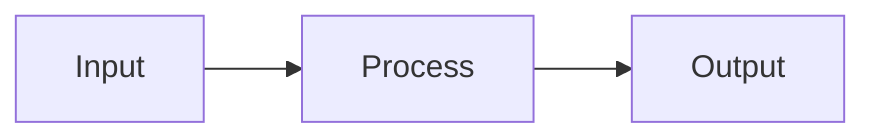

# Test Document

This is a simple test to verify the conversion works.

## Features

- **Markdown formatting**
- Syntax highlighting
- Mermaid diagrams
- Professional styling

## Code Example

```javascript
function hello(name) {
    console.log(`Hello, ${name}!`);
}

hello("World");
```

## Mermaid Diagram



## Conclusion

If you can see this as a PDF, it works! ✓
