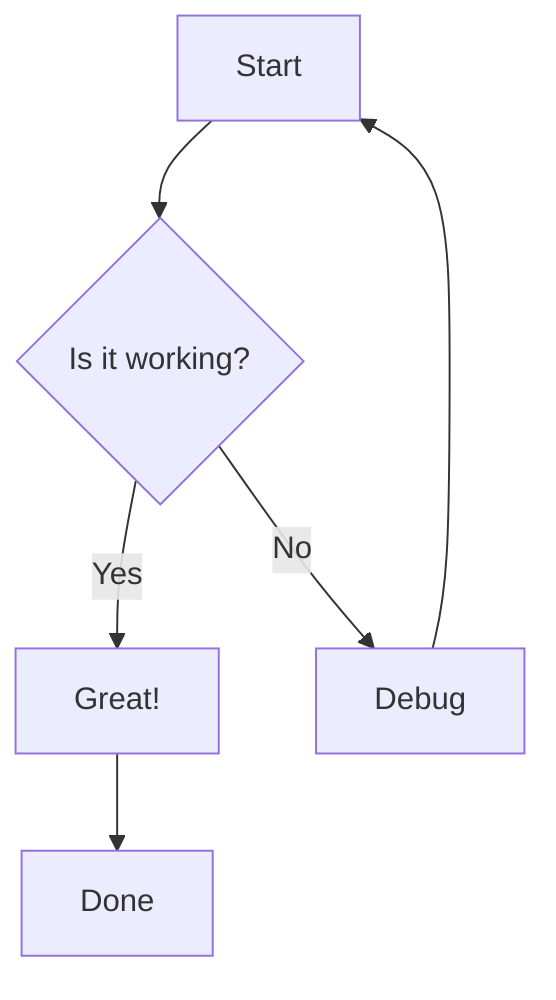
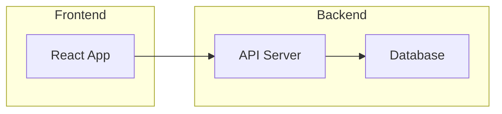

# Test Document for easy-markdown-to-pdf

This is a test document to verify the conversion process.

## Features to Test

This document tests the following features:

1. **Headers** - Multiple levels
2. **Bold and italic** text formatting
3. **Code blocks** with syntax highlighting
4. **Mermaid diagrams** - Auto-rendered
5. **Images** - If you have any
6. **Lists** - Ordered and unordered
7. **Links** - Internal and external

## Code Example

Here's a simple TypeScript function:

```typescript
function greet(name: string): string {
    return `Hello, ${name}!`;
}

console.log(greet("World"));
```

## Mermaid Diagram



## System Architecture



## Lists

### Unordered List
- First item
- Second item
  - Nested item
  - Another nested
- Third item

### Ordered List
1. Step one
2. Step two
3. Step three

## Links

- [Google](https://google.com)
- [GitHub](https://github.com)

## Inline Code

Use the `convert.sh` script with `--toc` flag for table of contents.

## Blockquote

> This is a quote to test blockquote formatting.
> It can span multiple lines.

---

## Conclusion

If you can see this document properly formatted as a PDF with:
- ✅ Proper headers and styling
- ✅ Rendered mermaid diagrams
- ✅ Syntax-highlighted code
- ✅ All text formatting

Then the conversion is working correctly!

---

**Generated:** $(date)
**Version:** 1.0
