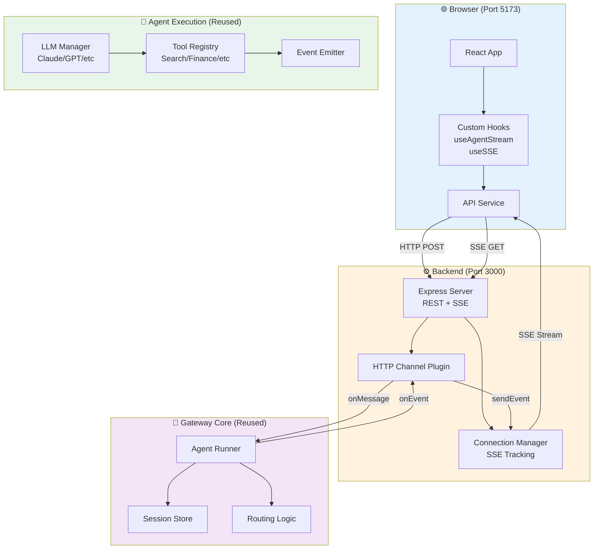
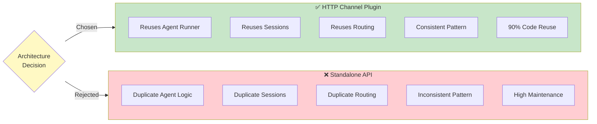
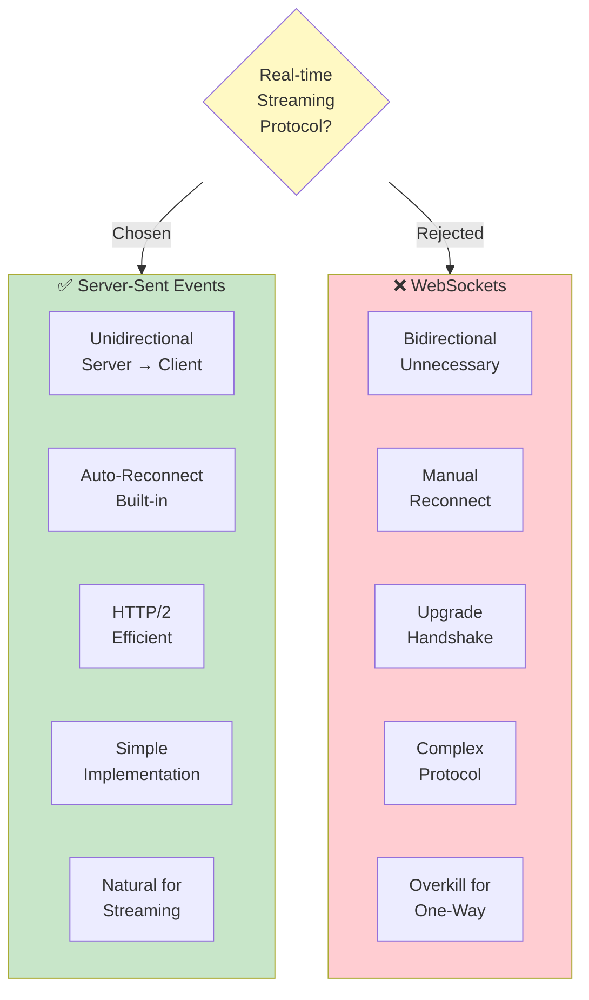
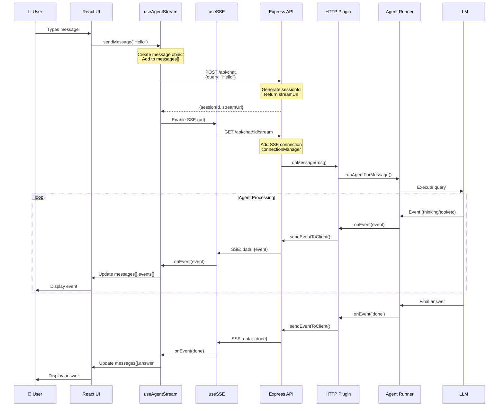
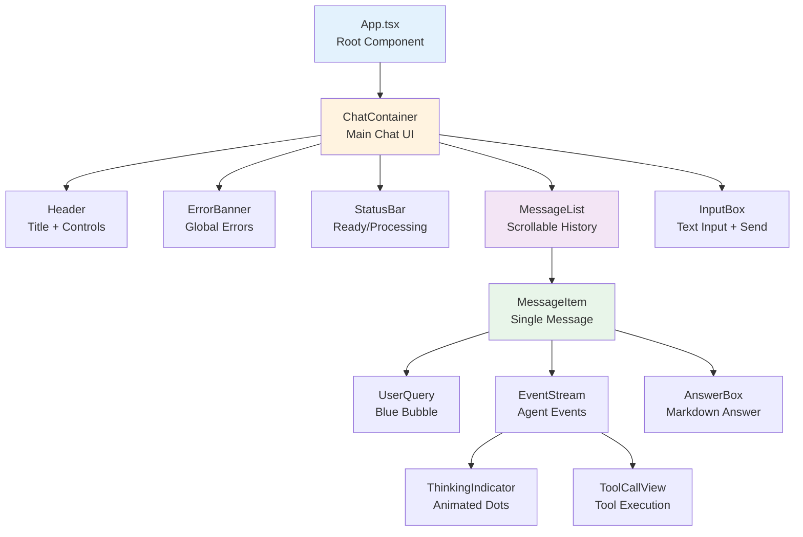
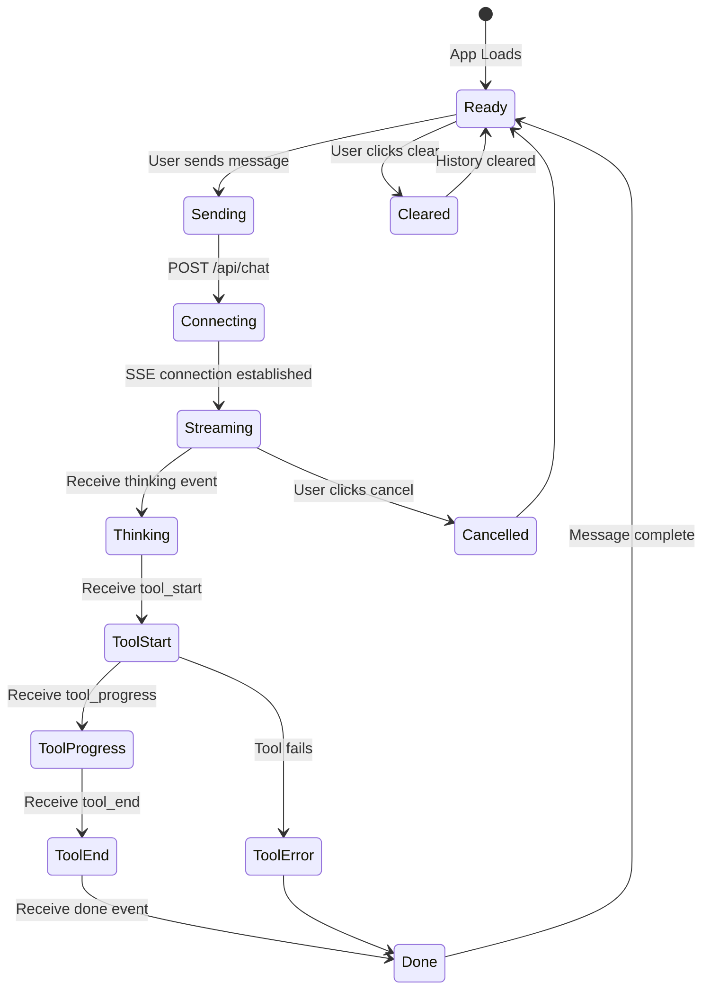
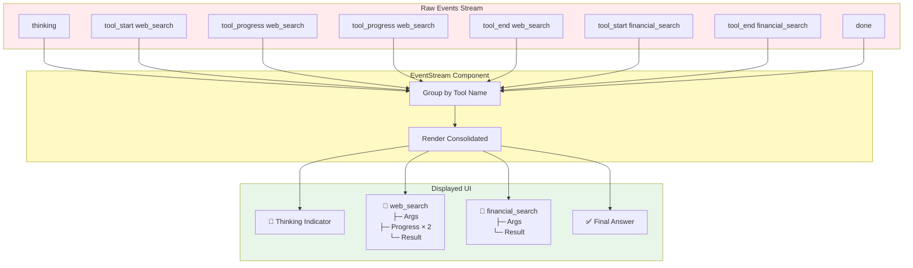
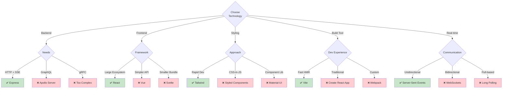
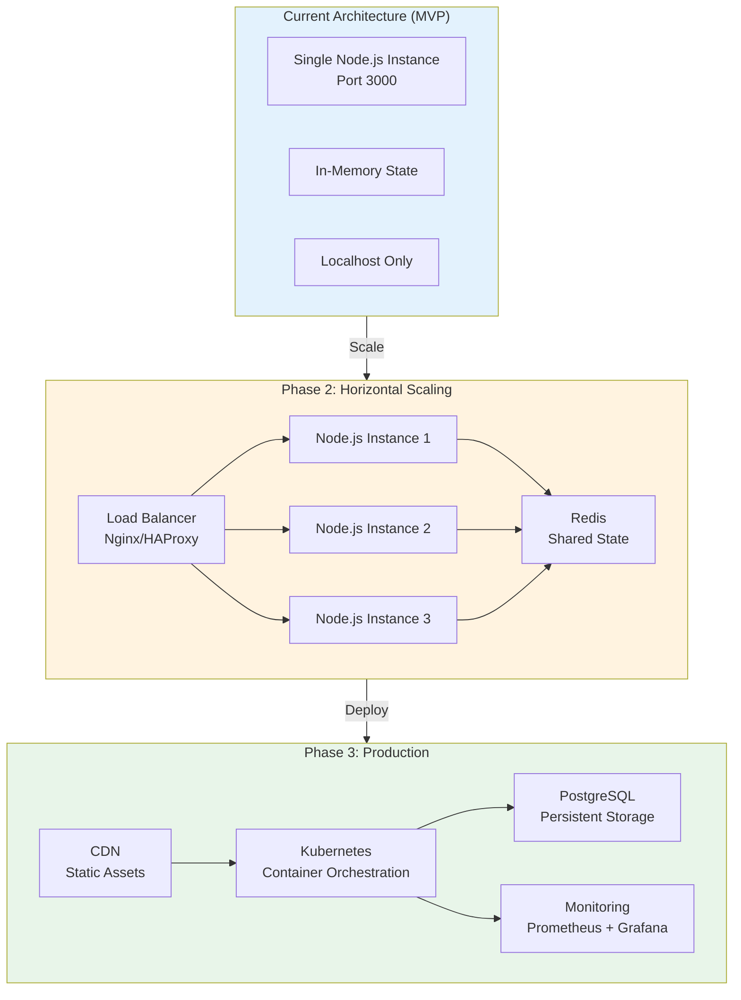
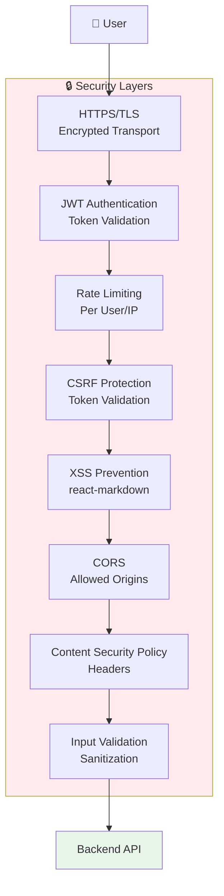

# Dexter Web Interface - Architecture Diagrams

Visual representations of the web interface architecture.

---

## 1. High-Level System Architecture

---

## 2. Critical Design Decision: Channel Plugin Pattern

---

## 3. Communication Protocol: SSE vs WebSockets

---

## 4. Complete Data Flow Sequence

---

## 5. Frontend Component Hierarchy

---

## 6. State Management Flow

---

## 7. Event Consolidation Strategy

---

## 8. Technology Stack Decision Tree

---

## 9. Scalability Strategy

---

## 10. Security Layers (Production)

---

## Viewing These Diagrams

**On GitHub:**
- Diagrams render automatically in markdown files
- Click to zoom

**In VS Code:**
1. Install: [Markdown Preview Mermaid Support](https://marketplace.visualstudio.com/items?itemName=bierner.markdown-mermaid)
2. Open this file
3. Press `Cmd+Shift+V` (macOS) or `Ctrl+Shift+V` (Windows)

**In Obsidian:**
- Built-in Mermaid support
- Diagrams render automatically

**Online:**
- Copy diagram code to [mermaid.live](https://mermaid.live)
- Export as PNG/SVG

---

**Last Updated:** 2026-02-14
